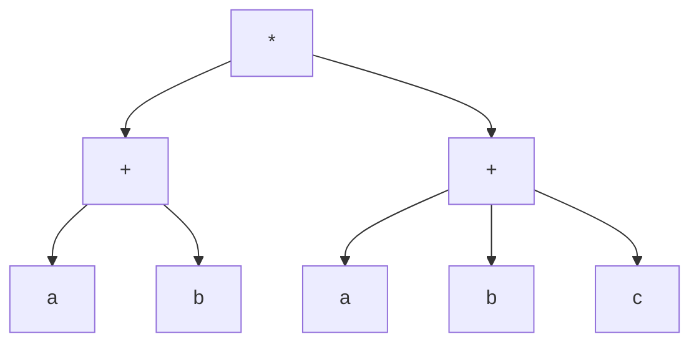
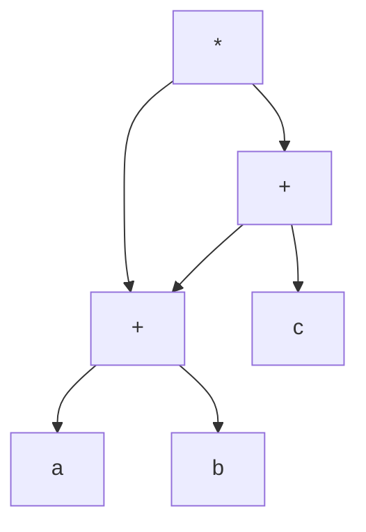
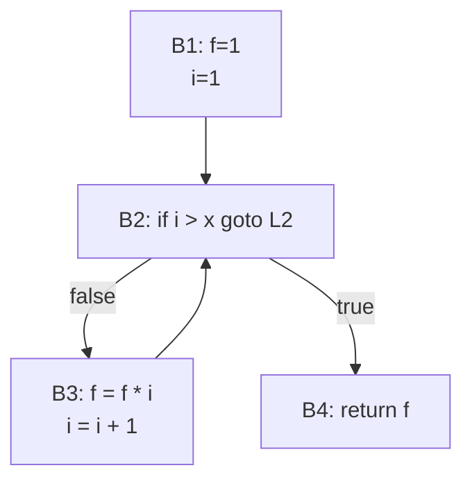

# Compiler

So basically compilers are what a tool to convert one type of code to another
type

6 phases

1. Lexical Analyser
2. Syntax Analysis
3. Semantic Analysis
4. Intermediate Code Generation
5. Code Optimisation
6. Target COde Generation

# 1. Lexical Analysis

Char to Token, we use a finite automata here
saves identifier to symbol table

main aim is to tokenise the code string

- it acts as a scanner
- returns back error messages like type mismatch, unmatched strings, illegal
  characters etc.
- it also eliminates comments, whitespaces etc

consider:

```cpp
int main(){
    return 0;
}
```

so a LEX would create a `lex.cc.y`

---

## |LEX| -char-> |TOKEN|

scan program via input buffering scheme, types: 1 buffer{1 at a time}, 2
buffer{2 at a time}

NFA-> DFA -> Minimised DFA
Minimised DFA -pattern-> Lexeme
Lexeme -> Symbol Table

LEX LEXEX is fast compared to handwritten C

# LEX Compilers

x.l -LEX-> lex.yy.c {lex analyser program in c}
lex.yy.c --c-compiler--> a.out {binary}

function is to remove comments, whitespaces, returns errors with specified line
numbers

# YACC

Yet Another Compiler
Generate parser from specified grammar
it i a syntax analyser which tries to detect error

input.y->|YACC| -> y.tab.c -> |C Compiler| -> a.out

# 2. Parsers

A parser checks if a string belongs to a grammar or not; applicable for spefici
context free grammar
2 types: Top Down, Bottom Up

1. Top Down

   - Recursive Decent
   - LL(1) / Predictive{LMD, Look Ahead 1(check if the next token is valid or
     not)}
   - consider it like need to create String from S Grammar
   - consumes LMD

2. Bottom Up
   - String to Production/Terminal
   - Child to Root
   - consumes RMD

Grammar will be given, need to create Syntax Tree to generate a given string

## First & Follow

First: what is derived at 1st step
Follow: terminal that follows to right

## LL(1) Parsing

Grammar is free from left recursion
free from ambiguity
left factored

consider
S-> AA
A-> aA
A-> b
string is `abab`

so therefore
S-> AA
S-> aAA
S-> abA
S-> abaA
S-> ababa

put it all into a Stack, maintain the production into single stack, then check
with a input string and as you unfold the production into string, as you get the
required terminal eliminate them with input string, like i get b at some point
at last in stack, and string is `abab` so `b-b` will get cancelled
look ahead-> |a|b|a|b|$|
stack->
b
a
A
b
a
A
A
A
S
$

## LR(0) Parsing

create a RMD
the right grammar is encountered with a `.`, when you move ahead a grammar , put `.` after a terminal/variable to indicate it is being already parsed
then open that variable
consider:

E-> T+E/T
T->id

ans->

stage 0:
E'->.E
E->.T+E
E->.T
T->.id

stage 1:
E'->E. {I1}
E'->T.+E {I2}
E->T.
T->id. {I3}

we observe that accepting state is already approached for a production, so don't
move forward, rest move forward for other
T->id. is directly reduced to id hence will be eliminated in next

stage 2:
E->T+.E {I4, approached from I2 via taking + into string}
E->.T+E
E->.T
T->.id

stage 3:
E->T+E. {I5; appriached from I4 via E}

stage 4:
E->T.+E {via T; from I4}
E->.T {go again to stage 3}

reduce to transition table

## State | id + $ | E T

0 |S3 |1 2
1 | accept |
2 | r2 S4/r2 r2 |
3 | r3 r3 r3 |
4 |S3 | s 2
5 | r1 r1 r2 |
Action state

## SLR (1) Parsing

not LR(-)-> Shift Reduce Conflict
parse table free from multiple entries
SLR(1) is more powerful from LR(0)
it's superset of LR(0)

| State | id  | +   | $      |
| ----- | --- | --- | ------ |
| 0     | S3  |
| 1     |     |     | accept |
| 2     |     | S4  | r2     |
| 3     |     | r5  | r3     |
| 4     | S3  |     |        |
| 5     |     |     | r1     |

## Operator Precednece

- only operator grammar
- not for every grammar
- used for scientific application
  No epsilon on RHS, no non-terminal on RHS

a<.b -> a has low precendence than b
a=b -> a has same precendence as b
a>.b -> a has high precendence than b

|       **OP\OP**       | `+` | `*` |  `(`  |  `)`  | `id`  |  `$`  |
| :-------------------: | :-: | :-: | :---: | :---: | :---: | :---: |
|     **`+`** (add)     | `>` | `<` |  `<`  |  `>`  |  `<`  |  `>`  |
|  **`*`** (multiply)   | `>` | `>` |  `<`  |  `>`  |  `<`  |  `>`  |
| **`(`** (left paren)  | `<` | `<` |  `<`  |  `=`  |  `<`  | `err` |
| **`)`** (right paren) | `>` | `>` | `err` |  `>`  | `err` |  `>`  |
|  **`id`** (operand)   | `>` | `>` | `err` |  `>`  | `err` |  `>`  |
| **`$`** (end symbol)  | `<` | `<` |  `<`  | `err` |  `<`  |  `=`  |

## LALR Parser

LALR<CLR
do all process of CLR, then merge the states to reduce to LALR

CLR will reduce to LALR parsers

## Bottom Up Parsers

reser of RMD
for complex grammar
fast than top-down paarser
also known as Shift-Reduce Parser
Shift: input pushed to stack
Reduce: tack symbol reduced to variable pr pop RHS of production or push LHS
Accept: parsed successfully, either S or $
Error: no action

3 components:

- Input Buffer
- Parse Stack
- Parse Table

# LR(0) Parse Table

## 📘 Grammar

```
S → (S)
S → S S
S → a
```

---

## 🔁 Transition Diagram

```
I₀:
  S → •(S)
  S → •S S
  S → •a

  on '(': go to I₁
  on 'S': go to I₂
  on 'a': go to I₃

I₁:
  S → (•S)
  S → •(S)
  S → •S S
  S → •a

  on '(': go to I₁
  on 'S': go to I₄
  on 'a': go to I₃

I₂:
  S → S • S

  on 'S': go to I₅

I₃:
  S → a•

I₄:
  S → (S•)

I₅:
  S → S S•
```

---

## 📋 LR(0) Parse Table

| State | `(` | `)` | `a` | `$`    | `S` |
| ----- | --- | --- | --- | ------ | --- |
| 0     | S₂  |     | S₃  |        | 1   |
| 1     |     |     |     | Accept |     |
| 2     | S₂  |     | S₃  |        | 4   |
| 3     |     | r3  |     | r3     |     |
| 4     |     | S₅  |     |        |     |
| 5     |     | r2  |     | r2     |     |

---

## 📋 SLR(1) Parse Table

**Note:** Uses Follow(LHS)

```
Follow(S) = { $, ) }
```

| State | `(` | `)` | `a` | `$`    | `S` |
| ----- | --- | --- | --- | ------ | --- |
| 0     | S₂  |     | S₃  |        | 1   |
| 1     |     |     |     | Accept |     |
| 2     | S₂  |     | S₃  |        | 4   |
| 3     |     | r3  |     | r3     |     |
| 4     |     | S₅  |     |        |     |
| 5     |     | r2  |     | r2     |     |

---

# Syntax Directed Tree/Translation

Grammar + Semantic Rules = SDT

A **Syntax Directed Tree** (commonly referred to through Syntax Directed Translation or Syntax Directed Definition) is a **parse tree** in which each node is annotated with **semantic information** (like types, values, etc.) based on **grammar rules**.

It is part of the broader concept of **Syntax Directed Translation**, where semantics are _driven by_ syntax (grammar).

---

## 🧠 Core Idea

You take a grammar like:

```
E → E + T
E → T
T → T * F
T → F
F → (E)
F → id
```

You then attach **attributes** to each grammar symbol (like `E.val`, `T.val`, etc.) and define **semantic rules** for how to compute them. This makes it a **Syntax Directed Definition (SDD)**.

The annotated parse tree based on SDD becomes the **Syntax Directed Tree**.

---

## 🏗️ Types of Attributes

1. **Synthesized Attributes**:
   Computed **from children** and passed **upward**.

2. **Inherited Attributes**:
   Computed **from parent or siblings** and passed **downward or sideways**.

---

## 🧾 Example Grammar and Semantic Rules (SDD)

Let’s define a grammar and show the rules that would build a syntax-directed tree to compute values of expressions like `3 + 5 * 2`.

### Grammar:

```
E → E + T    { E.val = E₁.val + T.val }
E → T        { E.val = T.val }
T → T * F    { T.val = T₁.val * F.val }
T → F        { T.val = F.val }
F → (E)      { F.val = E.val }
F → id       { F.val = id.lexval }
```

Here:

- `id.lexval` is the actual number represented by the identifier.
- Attributes like `val` are **synthesized**.

---

## 🌲 Example Parse and Syntax Directed Tree for `3 + 5 * 2`

### Input: `3 + 5 * 2`

### Derivation:

```
E → E + T
  → T + T
  → F + T
  → id + T
  → id + T * F
  → id + F * F
  → id + id * id
```

### Annotated Tree (Simplified for `val`):

```
           E (val=13)
         /   |    \
     E(3)   +   T(10)
             /   |   \
          T(5)  *   F(2)
```

**Evaluation:**

- `F → id` gives `F.val = 3`, `5`, `2`
- `T → F` or `T * F` computes `T.val`
- `E → T` or `E + T` computes `E.val`

---

## ✅ Uses of Syntax Directed Trees

- **Compiler Intermediate Representation (IR)**
- **Type checking**
- **Translation (e.g., to bytecode, assembly)**
- **Constant folding**
- **Semantic error detection**

---

## 📌 Summary Table

| Concept                    | Description                               |
| -------------------------- | ----------------------------------------- |
| SDD (Syntax Directed Def)  | Grammar + Semantic rules                  |
| SDT (Syntax Directed Tree) | Parse tree with attributes                |
| Synthesized Attributes     | From children up                          |
| Inherited Attributes       | From parent/siblings down/sideways        |
| Output                     | Annotated parse tree or intermediate code |

## 📘 1. Synthesized vs Inherited Attributes (from Syntax Directed Definitions)

| Feature                | **Synthesized Attributes**                           | **Inherited Attributes**                                 |
| ---------------------- | ---------------------------------------------------- | -------------------------------------------------------- |
| **Definition**         | Computed from **children nodes**                     | Computed from **parent or siblings**                     |
| **Direction of Flow**  | **Bottom-up** in the parse tree                      | **Top-down or lateral**                                  |
| **Use Case**           | Semantic value, types, expression evaluation         | Contextual info, symbol table scope, types               |
| **Example**            | `E → E₁ + T { E.val = E₁.val + T.val }`              | `T → int { T.type = T.inhType }` (inherited from parent) |
| **Ease of Use in LR**  | ✅ Easier to use in **bottom-up** parsing (e.g., LR) | ❌ Harder to use in bottom-up parsing                    |
| **Ease of Use in LL**  | ✅ OK                                                | ✅ Commonly used                                         |
| **Real World Analogy** | Child tells parent its result                        | Parent gives instruction to child                        |

---

## 🧠 2. **S-Attributed** vs **L-Attributed** Definitions

| Feature                | **S-Attributed SDD**                   | **L-Attributed SDD**                                                     |
| ---------------------- | -------------------------------------- | ------------------------------------------------------------------------ |
| **Definition**         | Uses **only synthesized** attributes   | Uses synthesized + **inherited (but restricted)**                        |
| **Parse Direction**    | Suited for **bottom-up (LR)** parsing  | Suited for **top-down (LL)** parsing                                     |
| **Attribute Flow**     | From children to parent                | From left to right (inherited allowed only from left siblings or parent) |
| **Ease of Evaluation** | Simple: one-pass bottom-up             | Slightly more complex due to inherited attributes                        |
| **Real Example**       | Arithmetic expression evaluation       | Symbol table propagation, type checking                                  |
| **Example**            | `E → E + T { E.val = E₁.val + T.val }` | `T → T1 * F { T.inh = T1.inh * F.type }`                                 |

---

# Intermediate Code Generation

create machine independent, low-level source code, optimisation, making compiler
more modular

so there is P1 machine, we compile something then phases like Lexical Analyser,
Syntax Analyser, Semantic Analyser, Intermediate Code Generation
so P1 does then we give same codr to P2, it will also do, time and energy
efficient it is not
so On IC phase we hypothetically save the generated code and then run it on
various places

4 Methods:

1. Machine independent
2. Abstract Syntax Tree
3. Direct Acyclic Graph
4. Post Fix
5. 3 Address Code

consider (a+b)\*(a+b+c)
convert to PostFix, #Ac, Syntax Tree, Direct Acyclic

# 🧮 Expression Analysis: `(a + b) * (a + b + c)`

---

## 📌 1. **Infix to Postfix Conversion**

We apply **operator precedence** and **associativity** rules:

```
Infix:    (a + b) * (a + b + c)
Postfix:  a b + a b + c + *
```

---

## 🌳 2. **Syntax Tree**

This is a full **parse/syntax tree** based on operator precedence.

```text
            (*)
           /   \
         (+)   (+)
        /   \   /  \
      (a)  (b) (b) (+)
                     \
                     (c)
```

### 👉 Explanation:

- Root is `*`
- Left subtree is `(a + b)`
- Right subtree is `(a + b + c)` represented as `((a + b) + c)`

---

## 🔁 3. **Three-Address Code (3AC)**

We break the expression into steps using temporary variables:

| Step | Code          |
| ---- | ------------- |
| t1   | t1 = a + b    |
| t2   | t2 = a + b    |
| t3   | t3 = t2 + c   |
| t4   | t4 = t1 \* t3 |

**Final Result:** `t4`

---

## 🔀 4. **Directed Acyclic Graph (DAG)**

This helps eliminate **common subexpressions** like `(a + b)`.
Only compute once and reuse.

```text
      (*)
     /   \
   (t1)  (t3)
    |     |
   (+)   (+)
  /   \  / \
a     b t1  c
```

### 👉 Reuse:

- `t1 = a + b` (used twice, but computed once)
- `t3 = t1 + c`
- `t4 = t1 * t3`

---

## 🗂️ Final Summary Table

| Representation      | Result / Structure                                        |
| ------------------- | --------------------------------------------------------- |
| Infix               | `(a + b) * (a + b + c)`                                   |
| Postfix             | `a b + a b + c + *`                                       |
| 3-Address Code      | `t1 = a + b`, `t2 = a + b`, `t3 = t2 + c`, `t4 = t1 * t3` |
| Optimized 3AC (DAG) | `t1 = a + b`, `t3 = t1 + c`, `t4 = t1 * t3`               |
| Syntax Tree         | Binary tree showing full operator precedence              |
| DAG                 | Graph showing reuse of `a + b` subtree                    |

---

### 🔲 Syntax Tree (Mermaid)



### 🔄 DAG (Mermaid)



---

# Code Generation

Intermediate Representation to Target Code
High Level-> 3 Address Code -> Assembly

```cpp
fact(x){
    int f=1;
    for(i=1;i<=x;i++)
        f=f*i;
    return f;
}
```

3 Address Code:

```c
(1) f = 1
(2) i = 1
(3) L1: if i > x goto L2
(4) t1 = f * i
(5) f = t1
(6) i = i + 1
(7) goto L1
(8) L2: return f

```

Block Diagram:
| Block | Instructions |
| ------ | -------------------------------------------------------------------- |
| **B1** | `(1) f = 1`<br>`(2) i = 1` |
| **B2** | `(3) L1: if i > x goto L2` |
| **B3** | `(4) t1 = f * i`<br>`(5) f = t1`<br>`(6) i = i + 1`<br>`(7) goto L1` |
| **B4** | `(8) L2: return f` |

3 Address Code:

```mermaid
B1:
    (1) f = 1
    (2) i = 1

B2:
    (3) L1: if i > x goto L2

B3:
    (4) t1 = f * i
    (5) f = t1
    (6) i = i + 1
    (7) goto L1

B4:
    (8) L2: return f
```

Control Flow Graph:

```vbnet
        ┌──────┐
        │ B1   │
        │ f=1  │
        │ i=1  │
        └──┬───┘
           ↓
        ┌───────┐
        │ B2    │
        │ if i>x│───Yes──→ B4 (return)
        └──┬────┘
           │No
           ↓
        ┌──────────────┐
        │ B3           │
        │ t1 = f * i   │
        │ f = t1       │
        │ i = i + 1    │
        │ goto B2      │
        └────┬─────────┘
             ↓
        ←────┘ (back to B2)

B4:
  return f

```



## Loop Jamming

optimise loop, combine body of 2/more loop when they share same index and no of
variable

```cpp
for(int i=0;i<10;i++)
    for(int j=0;i<=10;j++)
        x[i,j]="TOC"

for(int i=0;i<=10;i++)
    y[i]="CD"
```

combined to:

```cpp
for(int i=0;i<10;i++){
    for(int j=0;j<=10;j++){
        x[i,j]="TOC";
    }
    y[i]="CD";
}
```

## Loop unRolling

getting same output with less no of iteration

```cpp
int i=1;
while(i<=1--){
    cout<<i;i++;
}
```

unroll or optimise to:

```cpp
int i=1;
while(i<=50){
    cout<<i;i++;cout<<i;i++
}
```

## Code movement

move over the code out of loop which doesn't contribute anything, to loop

## Strength Reduction

2*x is hard as compared to x+x
y=2*x is converted to y=x+x
x\*2-> left shift
x/2-> right shift

## Redundant Code Elimination

x=a+b
y=b+a

convert to
x=a+b
y=x

## Algebraic Simplification

a=b\*1 to a=b
a=b+0 to a=b

# Direct Acyclic Graph

- Directed
- No Cycle
- when u optimise syntax tree we get DAG

ex: ((a+a)+(a+a))+((a+a)+(a+a))
Syntax Tree:

```txt
                    (+)
                  /     \
               (+)       (+)
             /    \     /    \
          (+)    (+)  (+)    (+)
         /  \   /  \  /  \   /  \
        a   a  a  a  a   a  a   a

```

Directed Acyclic Graph

```txt
         (+)
       /     \
     (+)     (+)
     |         |
   (+)       (+)
   |           |
 (a + a)     (a + a)

```

# Code Optimisation

| Feature                   | Platform-Independent Optimization          | Platform-Dependent Optimization            |
| ------------------------- | ------------------------------------------ | ------------------------------------------ |
| **Definition**            | General optimizations not tied to hardware | Hardware-specific optimizations            |
| **When Applied**          | Middle-end of compiler (IR level)          | Backend of compiler (target code gen)      |
| **Depends on Hardware?**  | ❌ No                                      | ✅ Yes                                     |
| **Portability**           | ✅ High — works across platforms           | ❌ Low — optimized for a specific platform |
| **Code Level**            | Intermediate Code / Source Code            | Assembly / Machine Code                    |
| **Examples**              | - Constant Folding                         | - Register Allocation                      |
|                           | - Dead Code Elimination                    | - Instruction Scheduling                   |
|                           | - Common Subexpression Elimination         | - Pipeline Optimization                    |
|                           | - Loop Invariant Code Motion               | - SIMD / AVX Usage                         |
|                           | - Inlining                                 | - Cache Optimization                       |
| **Reusability**           | Works across compilers and machines        | Tied to a specific CPU/ISA                 |
| **Complexity**            | Moderate                                   | High — requires hardware knowledge         |
| **Effect on Portability** | Increases portability                      | Reduces portability                        |
| **Optimization Goal**     | Generic performance boost                  | Exploit hardware for max performance       |
| **Tools/Stages**          | LLVM IR, GCC middle-end                    | x86, ARM codegen, backend schedulers       |

## Peephole Optimisation

1. Redundant load & Store
2. Strength Reduction
   x^2->x*x
   x*2->left shift
   x/2->right shift
3. Simplify Algebraic Exp
   a=a+0
   a=a\*1
   a=a/1
   a=a-0
4. replace slow instruction with fast
   Add #1,R -> Inc R
   Sub #1,R -> Dec R

5. Dead Code Elimination

- remove dead code
- remove unused code

## Loop Optimisation

1. Code Modify
   high freq code to low freq code

2. Loop Fusion
   merge loops to optimise
   meaning doesn't change

3. Loop Unrolling
   skip unused code
